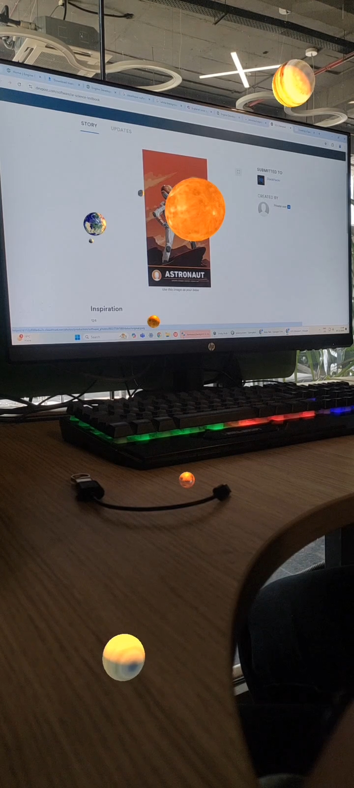
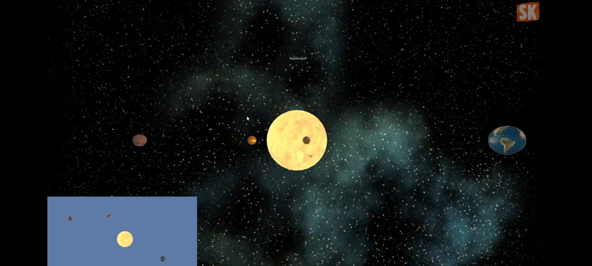
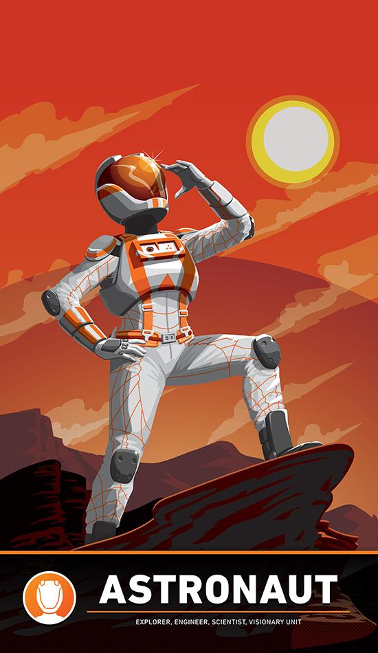

# AR Solar System Using Image Recognition 🌌🪐

## Project Description

**AR Solar System Using Image Recognition** is an Augmented Reality (AR) based educational application developed by **Isha Gupta** to provide an interactive and immersive way of learning about the Solar System.

The application uses **image recognition technology** to identify a predefined target image through the device camera. Once the target image is successfully recognized, the application displays an interactive **3D representation of the Solar System** in an Augmented Reality environment.

Users can explore the virtual Solar System through their device and observe the Sun and planets in an interactive 3D environment. The project demonstrates how **Image Recognition, Augmented Reality, 3D Visualization, and Interactive Learning** can be combined to create an engaging educational experience.

---

## 👩‍💻 Author

**Isha Gupta**

**Project:** AR Solar System Using Image Recognition

---

## 🎯 Objectives

The main objectives of this project are:

- To develop an interactive AR-based educational application.
- To implement image recognition for detecting a predefined target image.
- To display a virtual 3D Solar System after successful image detection.
- To provide an immersive and visual learning experience.
- To demonstrate the application of Augmented Reality in education.
- To make learning about planets and the Solar System more interactive.

---

## ✨ Key Features

- 🔍 **Image Recognition** – Detects the predefined Solar System target image.
- 🌌 **Augmented Reality** – Displays virtual Solar System content in the real-world environment.
- ☀️ **3D Solar System** – Provides a visual representation of the Sun and planets.
- 🪐 **Interactive Visualization** – Allows users to explore the virtual Solar System.
- 📚 **Educational Application** – Supports interactive learning of astronomical concepts.
- 📱 **Android Application** – The project is available as an Android APK.

---

## 🛠️ Technologies & Concepts

- Augmented Reality (AR)
- Image Recognition
- Computer Vision
- 3D Modelling
- 3D Visualization
- Android Application Development
- Interactive Educational Technology

---

# 📱 Release

The Android application is available as a downloadable APK through the **GitHub Releases** section.

## AR Solar System v1.0

This is the initial release of the **AR Solar System Using Image Recognition** application developed by **Isha Gupta**.

The release contains the Android APK required to run the AR application.

### ⬇️ Download Application

**[Download AR Solar System v1.0 APK](https://github.com/isha052003/AR-SOLAR-SYSTEM-USING-IMAGE-RECOGNITION/releases/latest)**

### Installation

1. Download the APK from the latest release i.e. v1.0
2. Transfer the APK to an Android device (to access the application).
3. Install the application.
4. Open the application.
5. Allow camera permission when prompted.
6. Place the provided Image Target in front of the camera.
7. Allow the application to recognize the target image.
8. Explore the AR Solar System.

> **Note:** The APK is provided through GitHub Releases because the application binary is larger than the standard web upload limit for repository files.

---

# 📸 Screenshots

This section contains screenshots demonstrating the working of the **AR Solar System Using Image Recognition** application.

## 1. AR Solar System Working

The following screenshot demonstrates the AR Solar System after successful image recognition.



## 2. Desktop View

The following screenshot shows the desktop view of the AR Solar System project.



### 📂 Screenshots Folder

The complete screenshots and their description are available in the **Screenshots** folder.

- [AR Solar System Working](Screenshots/ar-solar-system-working.jpeg)
- [AR Solar System Desktop View](Screenshots/ar-solar-system-desktop-view.jpeg)
- [Screenshots README](Screenshots/README.md)

---

# 🖼️ Image Target

The application uses a predefined **Image Target** for image recognition.

The Image Target acts as a visual marker for the Augmented Reality system. When the device camera detects and recognizes the predefined image, it triggers the AR experience and displays the virtual **3D Solar System** over the detected target.

## Solar System Image Target



The target image connects the real-world environment with the virtual AR content and is required to activate the Solar System visualization.

### 📂 Image Target Files

- [Solar System Target Image](Image-Target/solar-system-target.jpeg)
- [Image Target README](Image-Target/README.md)

---

# 🎥 Video Capture

This section contains video demonstrations of the **AR Solar System Using Image Recognition** application.

The videos demonstrate the image recognition process, activation of the Augmented Reality environment, and visualization of the virtual 3D Solar System.

## 1. AR Solar System Demo

**[▶️ View AR Solar System Demo](Video-Capture/ar-solar-system-demo.mp4)**

This video demonstrates the basic working of the application after the Image Target has been successfully recognized.

## 2. Broader View Demonstration

**[▶️ View Broader AR Solar System View](Video-Capture/ar-solar-system-broader-view.mp4)**

This video provides a broader view of the AR environment and demonstrates the Solar System visualization from a wider perspective.

### 📂 Video Capture Files

- [AR Solar System Demo](Video-Capture/ar-solar-system-demo.mp4)
- [Broader AR Solar System View](Video-Capture/ar-solar-system-broader-view.mp4)
- [Video Capture README](Video-Capture/README.md)

---

# 🔄 How the Application Works

The basic workflow of the application is:

```text
Camera
   ↓
Image Target Detection
   ↓
Image Recognition
   ↓
Target Successfully Recognized
   ↓
Augmented Reality Triggered
   ↓
3D Solar System Displayed
   ↓
Interactive Visualization


## 🛠️ Development Tools

### Unity
Unity was used as the primary development environment for creating
the Augmented Reality Solar System application, including the AR
scene, image recognition setup, 3D visualization, and Android build.

### Sketchfab
Sketchfab was used for obtaining 3D graphical assets used in the
Solar System visualization.

### GitHub
GitHub was used for project documentation, version control, asset
organization, and distribution of the final application.

### GitHub Releases
The final Android APK is distributed through GitHub Releases.
